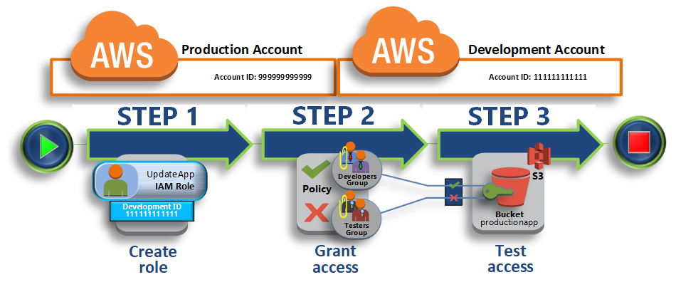
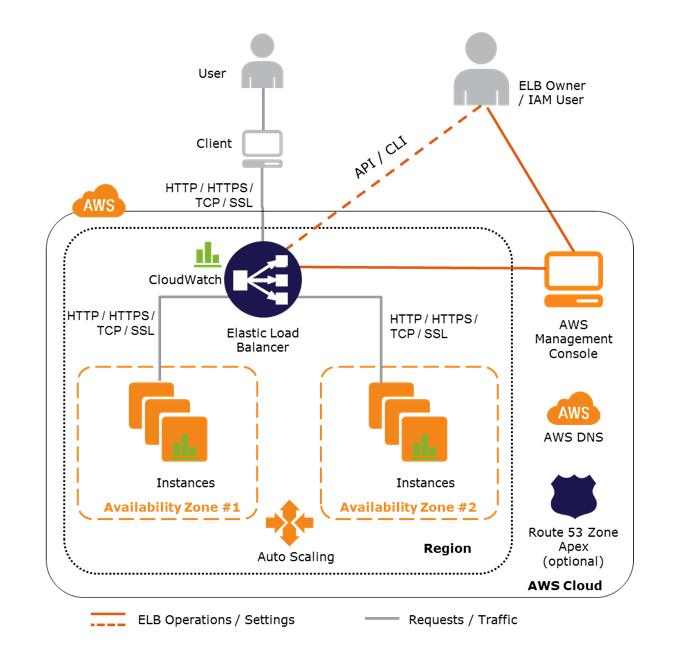

# Cybersecurity

## Introduction
Amazon web services (AWS) delivers a scalable cloud computing platform designed for high availability and
dependability, providing the tools that enable you to run a wide range of applications.
* The AWS architecture has be architected to be one of the most flexible and secure cloud computing environments
  available today.
* This infrastructure is built and managed not only according to security best practices and standards, but also
  with the unique needs of the cloud in mind.
* AWS provides security-specific tools and features across network security, configuration management, access control
  and data security.
* AWS uses redundant and layered controls, continious validation and testing, and a substantial amount of automation
  to ensure that the underlying infrastructure is monitored and protected 24x7.
* AWS provides monitoring and logging tools that can provide full visibility into what is happening in your environment.

### AWS Global Cloud Infrastructure
Building on the AWS secure global infrastructure, you install and configure your OS and platforms in the AWS cloud
just as you would do on premises in your own data centers. Then you install your applications on your platform. Ultimately,
your data resides in and is managed by your applications. Unless you have more stringent business or compliance requirements,
you don't need to introduce additional layers of protection beyond those provided by the AWS secure global infrastructure.
* The AWS global cloud infrastructure is built around Regions and Availability Zones.
* AWS operates the global cloud infrastructure that you use to provision a variety of basic computing resources such as
  processing and storage.
* The AWS global infrastructure includes the facilities, network, hardware, and operational software (e.g., host OS, 
  virtualization software, etc.) that support the provisioning and use of these resources.
* The AWS global infrastructure is designed and managed according to security best practices as well as a variety of
  security compliance standards.
* The AWS secure global infrastructure and services are subject to regular third-party compliance audits.

### AWS Shared Security Responsibility Model (M1.3.4)
* AWS is responsible for protecting the global infrastructure that runs all of the services offered in
  the AWS cloud. This infrastructure is comprised of the hardware, software, networking, and facilities
  that run AWS services.
* In addition to protecting the global infrastructure, AWS is responsible for the security configuration
  of its products that are considered managed services.
* You're responsible for securing anything you put on the cloud or connect to the cloud. Meaning, the customer
  assumes responsibility and management of the guest OS (including updates and security patches), other
  associated application software as well as the configuration of the AWS provided security group firewall.
* Customers should carefully consider the services they choose as their responsibilites vary depending on the
  services used, the integration of those services into their IT environment, and applicable laws and regulations.

### AWS Security Platform
The AWS cloud provides you with a platform to scale and innovate, while still maintaining a secure environment.
AWS and its partners offer a wide range of tools and features to help you meet your security objectives.

These tools mirror the familiar controls you deploy within your on-premises environments.

| Service | Product Type | Description
| --- | --- | ---|
Amazon VPC | Virtual Private Cloud| Amazon VPC lets you provision a logically isolated section of the AWS cloud where you can launch AWS resources in a virtual network that you define. |
AWS WAF | Web Application Firewall | AWS WAF is a web application firewall that helps protect your web applications from common web exploits that could affect application availability, comprimise security, or consume excessive resources. |
AWS Artifact | Compliance Reports | The AWS artifact portal provides on-demand access to AWS' security and compliance documents, also known as audit artifacts.|
AWS Certificate Manager | SSL/TLS Certificates | AWS Certificate Manager is a service that lets you easily provision, manage, and deploy SSL/TLS certificates.|
Amazon CLoud Directory | Directory | Amazon Cloud Directory enables you to build flexible cloud-native directories for organizing hierarchies of data along multiple dimensions.|
Amazon CloudHSM | Key Storage & Management | The AWS CloudHSM helps you meet corporate, contractual, and regulatory compliance requirements for data security by using dedicated Hardware Security Module (HSM) appliances within the AWS cloud. |
AWS Directory Service | Directory | AWS Directory Service for Microsoft Active Directory (enterprise edition), also known as AWS Microsoft AD, enables your directory-aware workloads on AWS resources to use managed Active Directory in the AWS Cloud.|
AWS IAM | Access Control | Use AWS IAM to control users' access to AWS services. Create and manage users and groups, and grant or deny access. |
Amazon Inspector | Security Assessment | Amazon Inspector is an automated security assessment service that helps improve the security and compliance of applications deployed on AWS.|
Amazon Key Management Service | Key Storage & Management | AWS Key Management Service (KMS) is a managed service that makes it easy for you to create and control the encryption keys used to encrypt your data. |
AWS Organization | Multiple Account Management | AWS Organization offers policy-based management for multiple AWS accounts. With organizations, you can create groups of accounts and then apply policies to those groups.|
AWS Shield | DDoS protection | AWS Shield is a managed Distributed Denial of Service (DDoS) protection service that safeguards web applications running on AWS.| 

## IAM (Identity and Access Management)
With IAM, you can centrally manage users, security credentials such as passwords, access keys, and permission policies that control which
AWS services and resources users can access. IAM lets you create individual users within your AWS account and give them each their own
username, password, and access keys. Individual users can then log into the console using a URL that's specific to your account.

AWS Tech Tips:
* When you sign up for AWS, you create an AWS account, for which you have a user name (your email address) and a password. The
  user name and password let you log into the AWS Management Console, where you can use a browser-based interface to manage 
  AWS resources.
* You can also create access keys (which consist of an access key ID and secret access key) to use when you make programmatic calls
  to AWS using the CLI, the AWS SDKs, or API calls.
* You can also create access keys for individual users so that they can make programmatic calls to access AWS resources. All
  charges for activities performed by your IAM users are billed to your AWS account.
* As a best practice, we recommend that you create an IAM user even for yourself and that you do not use your AWS account credentials
  for everyday access to AWS.

Key Terms:
* AWS Account - This is the account that you create when you first sign up for AWS. Your AWS account represents a business
  relationship between you and AWS. You use your AWS account to manage your AWS resources and services.
* IAM Users - With IAM you can create multiple users, each with individual security credentials, all controlled under a single
  AWS account. IAM users can be a person, service, or application that needs access to your AWS resources through the management
  console, CLI, or directly via APIs.

**Notes when creating users**

Create credentials for the user, depending on the type of access the user requires:
* Programmatic access: The IAM user might need to make API calls, use the AWS CLI, or use the Tools for Windows Powershell.
  In that case, create an access key (access key ID and a secret access key) for that user.
* AWS Management Console access: If the user needs to access the AWS Management Console, create a password for the user.

As best practice, create only the credentials that the user needs.

**Delegate Access Across AWS Accounts**

This scenario shows you how to use a role to delegate access to resources that are in different AWS accounts
that you own (Production and Development). You share resources in one account with users in a different account.
By setting up cross-account access in this way, you don't need to create individual IAM users in each account.
In addition, user's don't have to sign out of one account and sign into another in order to access resources in
different AWS accounts. After configuring the role, you see how to use the role from the AWS Management Console,
the AWS CLI, and the API.

In this scenario, imagine that the Production account is where live applications are managed. The Development
account is a sandbox where developers and testers can freely test applications. In each account, application
information is stored in Amazon S3 buckets. You manage IAM users in the Development account, where you have two
IAM groups: Developers and Testers. Users in both groups have permissions to work in the Development account and
access resources there. From time to time, a developer must update the live applications in the Production account.
These applications are stored in an Amazon S3 bucket called `productionapp`.

Developers can use the role in the AWS Management Console to access the `productionapp` bucket in the Production
account. They can also access the bucket by using API calls that are authenticated by temporary credentials provided
by the role. Similar attempts by a Tester to use the role fail.

### Delegation, Federation and Multi-Factor Authentication

**Federation**

If your organization already has its own identity system, such as a corporate user directory, you can use IAM identity
providers instead of creating IAM users in your AWS account. With an identity provider (IdP), you can manage your user
identities outside of AWS and give these external user identities permissions to use AWS resources in your account.
This is also useful if you are creating a mobile app or web application that requires access to AWS resources.

**Delegation**

You can use IAM roles to delegate access to your AWS resources. With IAM roles, you can establish trust relationships
between your trusting account and other AWS trusted accounts. The trusting account owns the resource to be accessed
and the trusted account contains the users who need access to the resource.

**Multi-Factor Authentication**

This is a simple best practice that adds an extra layer of protection on top of your username and password. With MFA
enabled, when a user signs in to an AWS website, they will be prompted for their username and password (the first
factor--what they know), as well as for an authentication code from their AWS MFA device (the second factor--what
they have). Taken together, these multiple factors provide increased security for your AWS account settings and
resources.

### IAM Best Practices

To help secure your AWS resources, follow these recommendations for the AWS Identity and Access Management (IAM) service:

* Lock Away Your AWS Account Root User Access Keys
* Create Individual IAM Users
* Use AWS Defined Policies to Assign Permissions Whenever Possible
* Use Groups to Assign Permissions to IAM Users
* Grant Least Privilege
* Use Access Levels to Review IAM Permissions
* Configure a Strong Password Policy for Your Users
* Enable MFA for Privileged Users
* Use Roles for Applications That Run on Amazon EC2 Instances
* Delegate by Using Roles Instead of by Sharing Credentials
* Rotate Credentials Regularly
* Remove Unnecessary Credentials
* Use Policy Conditions for Extra Security
* Monitor Activity in Your AWS Account

## Networking with AWS

Following the shared responsibility model, AWS configures the infrastructure components such as data center networks,
routers, switches, and firewalls in a secure fashion. You are responsible for controlling access to your systems in 
the cloud and for configuring network security within your Amazon VPC, as well as secure inbound and outbound network traffic.

AWS provides several security capabilities and services to increase privacy and control network access. These include:

* Built-in firewalls that allow you to create private networks within AWS, and control network access to your instances and subnets
* Encryption in transit with TLS across all services
* Connectivity options that enable private, or dedicated, connections from your office or on-premises environment
* DDoS mitigation technologies as part of your auto-scaling or content delivery strategy

### Amazon Virtual Private Cloud (VPC)

AWS provides a range of networking services that enable you to create a logically isolated network that you define,
establish a private network connection to the AWS cloud, use a highly available and scalable DNS service and deliver
content to your end users with low latency at high data transfer speeds with a content delivery web service.

Amazon VPC enables you to launch AWS resources into a virtual network that you've defined. This virtual network closely
resembles a traditional network that you'd operate in your own data center, with the benefits of using the scalable
infrastructure of AWS.

A VPC is logically isolated from other virtual networks in the AWS cloud. You can launch your AWS resources, such as
Amazon EC2 instances, into your VPC; you can select its IP address range, create subnets, and configure route tables,
network gateways, and security settings.

### AWS Direct Connect

AWS Direct Connect makes it easy to establish a dedicated network connection from your premises to AWS. Using AWS
Direct Connect, you can establish a private connectivity between AWS and your datacenter, office, or colocation
environment, which in many cases can reduce your network costs, increase bandwidth throughput, and provide a more
consistent network experience than Internet-based connections.

There are several use cases for which AWS Direct Connect is desirable, including:

* Working with large data sets: When you use the cloud, you can find that transferring large data sets can be slow
  because your critical network traffic is contending for bandwidth with your other internet usage. With AWS Direct
  Connect, you can transfer your business critical data directly from your datacenter, office, or colocation environment
  into and from AWS bypassing your Internet service provider and removing network congestion.
* Real-time Data Feeds: Network latency over the Internet can vary given that the Internet is constantly changing how
  data gets from point A to point B. With AWS Direct Connect, you control how your data is routed, which can provide
  a more consistent network experience over Internet-based connections.
* Hybrid Environments: AWS Direct Connect can help you build hybrid environments that satisfy regulatory requirements
  requiring the use of private connectivity. Hybrid environments allow you to combine the elasticity and economic
  benefits of AWS with the ability to utilize other infrastructure that you already own.

### Elastic Load Balancing

Elastic Load Balancing automatically distributes incoming application traffic across multiple targets, such as Amazon
EC2 instances, containers, and IP addresses. It can handle the varying load of your application traffic in a single
Availability Zone or across multiple availability zones. Elastic Load Balancing offers 3 types of load balancers:
Application Load Balancer, Network Load Balancer, and Classic Load Balancer.

**Using Elastic Load Balancing in your Amazon VPC**

Elastic Load Balancing makes it easy to create an internet-facing entry point into your Amazon VPC. You can assign
security groups to your load balancer to control which ports are open to a list of allowed sources. Together,
Elastic Load Balancing works with Amazon VPC to provide you the flexibility to centrally manage SSL settings and
offload CPU intensive workloads from your applications.

**Architecture of the Elastic Load Balancing Service and How It Works?**

There are two logical components in the Elastic Load Balancing service architecture: load balancers and a controller
service. The load balancers are resources that monitor traffic and handle requests that come in through the internet.
The controller service monitors the load balancers, adds and removes capacity as needed, and verifies that load
balancers are behaving properly.

### Amazon Route 53

Amazon Route 53 is a highly available and scalable cloud Domain Name System (DNS) web service. It is designed to
give developers and businesses an extremely reliable and cost effective way to route end users to Internet applications
by translating names like www.example.com into numeric IP addresses like 192.0.2.1 that computers use to connect to
each other. Amazon Route 53 effectively connects to user requests to infrastructure running in AWS--such as Amazon EC2
instances, Elastic Load Balancing load balancers, or S3 buckets--and can also be used to route users to infrastructure
outside of AWS.

### AWS Key Management Service

AWS Key Management Service (KMS) is a managed service that makes it easy for you to create and control the encryption
keys used to encrypt your data, and uses Hardware Security Modules (HSMs) to protect the security of your keys.

By using AWS KMS, you gain more control over access to data you encrypt. You can use the key management and cryptographic
features directly in your applications or through AWS services that are integrated with AWS KMS. Whether you are writing
applications for AWS or using AWS services, AWS KMS enables you to maintain control over who can use your master keys
and gain access to your encrypted data.

**Master Keys**

AWS KMS lets you create master keys that can never be exported from the service and which can be used to encrypt and
decrypt data based on policies you define.

You can perform the following management actions on master keys by using AWS Key Management Services:
* Create, describe, and list master keys
* Enable and disable master keys
* Set and retrieve master key usage policies (access control)
* Create, delete, list, and update aliases, which are friendly names that point to your master keys
* Delete master keys to complete the key lifecycle

You can also perform the following cryptographic functions using AWS Key Management Services:
* Encrypt, decrypt, and re-encrypt data
* Generate data encryption keys that you can export from the service in plaintext or encrypted under a master key that
  doesn't have the service.
* Generate random numbers suitable for cryptographic applications
