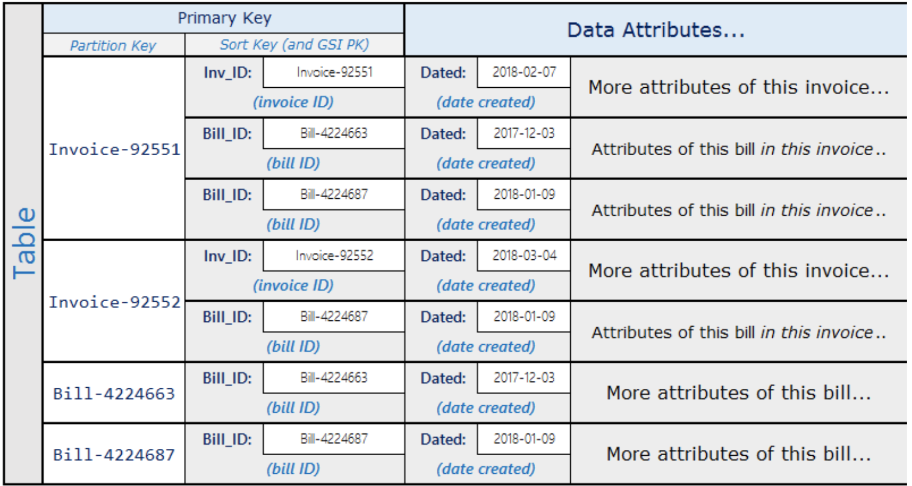

# DynamoDB Notes

## Differences between Relational Data Design and NoSQL
* In RDBMS, data can be queried flexibly, but queries are relatively expensive and don’t scale well in high traffic situations. 
* In a NoSQL database, data can be queried efficiently in a limited number of ways, outside of which queries can be expensive and slow.
* In RDBMS, you design for flexibility without worrying about implementation details or performance. Query optimization generally doesn’t affect schema design but
normalization is very important. In DynamoDB you design your schema specifically to make the most common and important queries as fast and as inexpensive as possible. Your data structures are tailored to the specific requirements of your business use cases.

## Two key concepts for NoSQL Design
NoSQL design requires a different mindset than RDBMS design. For an RDBMS, you can go ahead and create a normalized data model without thinking about access patterns. You can then extend it later when new questions and query requirements arise. You can organize each type of data into its own table.

NoSQL is different
* For DynamoDB, by contrast, you shouldn’t start designing your schema until you know the questions it will need to answer. Understanding the business problems and application use cases up front is essential.
* You should maintain as few tables as possible in a DynamoDB app. Most well designed apps require only ONE table.

## Approaching NoSQL Design
The first step in designing your DynamoDB app is to identify the specific query patterns that the system must satisfy.

In particular it is important to understand three fundamental properties of your app’s access patterns before you begin:
* Data Size: Knowing how much data will be stored and requested at one time will help determine the most effective way to partition the data.
* Data Shape: Instead of reshaping data when a query is processed (as an RDBMS system does), a NoSQL database organizes data so that its shape in the database corresponds with what will be queried. This is a key factor in increasing speed and scalability.
* Data Velocity: DynamoDB scales by increasing the number of physical partitions that are available to process queries, and by efficiently distributing data across those partitions. Knowing in advance what the peak query loads might be helps determine how to partition data to best use I/O capacity.

After you identify specific query requirements, you can organize data according to general principles that govern performance:
* Keep Related Data Together
* Use sort order: Related items can be grouped together and queried efficiently if their key design causes them to sort together. This is an important NoSQL design strategy.
* Distribute Queries: It is also important that a high volume of queries not be focused on one part of the database, where they can exceed I/O capacity. Instead you should design data keys to distribute traffic evenly across partitions as much as possible, “avoiding hot spots”
* Use global secondary indexes: By creating specific global secondary indexes, you can enable different queries than your main table can support, and that are still fast and relatively inexpensive.

## Choose the right DynamoDB Partition Key
Choosing the right partition key is an important step in the design and building of scalable and reliable applications
on top of DynamoDB.

### What is a partition key?
DynamoDB supports two types of primary keys:
* Partition key: A simple primary key, composed of one attribute known as the *partition key*. Attributes in DynamoDB
are similar in many ways to fields or columns in other database systems.
* Partition key and sort key: Referred to as a *composite primary key*, this type of key is composed of two attributes.
The first attribute is the *partition key*, and the second attribute is the *sort key*.

### Why do I need a partition key?
DynamoDB stores data as a group of attributes, known as *items*. Items are similar to rows or records in other database
systems. DynamoDB stores and retrieves each item based on the primary key value, which must be unique. Items are distributed
across 10-GB storage units, called partitions (physical storage internal to DynamoDB). Each table has one or more partitions.
DynamoDB uses the partition key's value as an input to an internal hash function. The output from the hash function determines
the partition in which the item is stored. Each item's location is determined by the hash value of its partition key. All items
with the same partition key are stored together, and for composite partition keys, are ordered by the sort key value. DynamoDB
splits partitions by sort key if the collection size grows bigger than 10GB.

### Partition keys and request throttling
DynamoDB evenly distributes *provisioned throughput*--read capacity units (RCUs) and write capacity units (WCUs)--among
partitions and automatically supports your access patterns using the throughput you have provisioned. However, if your
access pattern exceeds 3000 RCU or 1000 WCU for a single partition key value, your requests might be throttled with a
`ProvisionedThroughputExceededException` error.

Reading or writing above the limit can be caused by these issues:
* Uneven distribution of data due to the wrong choice of partition key
* Frequent access of the same key in a partition (the most popular item, also known as a hot key).
* A request rate greater than the provisioned throughput.

To avoid request throttling, design your DynamoDB table with the right parition key to meet your access requirements and
provide even distribution of data.

Recommendations for partition keys
* **Use high-cardinality attributes**. These are attributes that have distinct values for each item, like `e-mailid`,
`employee_no`, `customerid`, `sessionid`, `orderid`, and so on.
* **Use composite attributes**. Try to combine more than one attribute to form a unique key, if that meets your access
pattern. For example, consider an orders table with `customerid+productid+countrycode` as the partition key and `order_date`
as the sort key.
* **Cache the popular items** when there is a high volume of read traffic using Amazon DynamoDB Accelerator (DAX).

## Best Practices for Designing and Using Partition Keys Effectively
The primary key that uniquely identifies each item in a DynamoDB table can be simple (partition key only) or composite (a partition key combined with a sort key). Generally speaking, you should design your application for uniform activity across all logical partition keys in the table and its secondary indexes. 

## Designing Partition Keys to Distribute your Work Evenly
The partition key portion of a table’s primary key determines the logical partitions in which a table’s data is stored. This is turn affects the underlying physical partitions. Provisioned I/O capacity for the table is divided evenly among these physical partitions. Therefore a partition key design that doesn’t distribute I/O requests evenly can create “hot” partitions that result in throttling and use your provisioned I/O capacity inefficiently.

## Best Practices for Using Sort Keys to Organize Data
In a DynamoDB table, the primary key that uniquely identifies each item in the table can be composed not only of a partition key, but also of a sort key.
Well designed sort keys have two key benefits:
1. They gather related information together in one place where it can be queried efficiently. Careful design of the sort keys lets you retrieve commonly needed groups of related items using range queries with operators such as starts-with, between, >, <, and so on.
2. Composite sort keys let you define hierarchical (one-to-many) relationships in your data that you can query at any level of the hierarchy.

## Best Practices for Using Secondary Indexes in DynamoDB 
Secondary indexes are often essential to support the query patterns that your application requires. At the same time, overusing secondary indexes or using them inefficiently can add cost and reduce performance unnecessarily. 

Amazon DynamoDB supports two types of secondary indexes:
1. Global Secondary Index - An index with a partition key and a sort key that can be different from those on the base table. A global secondary index is considered global because queries on the index can span all of the data in the base table, across all partitions. A global secondary index has no size limitations and has its own provisioned throughput settings for read and write activity that are separate from those on the table.
2. Local Secondary Index - An index that has the same partition key as the base table, but a different sort key. A local secondary index is “local” in the sense that every partition of a local secondary index is scoped to a base table partition that has the same partition key value. As a result, the total size of indexed items for any one partition key value can’t exceed 10 GB. Also, a local secondary index shares provisioned throughput settings for read and write activity with the table is indexing. 

Each table in DynamoDB is limited to a max of five global secondary indexes and five local secondary indexes. For global secondary indexes, this is less restrictive than it might appear because you can satisfy multiple application access patterns with one global secondary index by overloading it.

In general you should use global secondary indexes rather than local secondary indexes. The exception is when you need strong consistency in your query results, which a local secondary index can provide but a global secondary index cannot (global secondary index queries only support eventual consistency).

Some principles and design patterns to keep in mind when creating indexes in DynamoDB
* Use indexes efficiently
    * Keep the number of indexes to a minimum
    * Avoid indexing tables that experience heavy write activity
* Choose Projections Carefully
    * Because secondary indexes consume storage and provisioned throughput, you should keep the size of the index as small as possible.
* Optimize Frequent Queries to Avoid Fetches
    * To get the fastest queries with the lowest possible latency, project all the attributes that you expect those queries to return.
* Be aware of Item-Collection Size limits when creating local secondary indexes 

## Take advantage of Sparse Indexes
For any item in a table, DynamoDB writes a corresponding index entry only if the index sort key value is present in the item. If the sort key doesn’t appear in every table item, the index is said to be sparse.

## Best Practices for Querying and Scanning Data
Performance considerations for Scans
* In general, Scan operations are less efficient than other operations in DynamoDB. A Scan operation always scans the entire table or secondary index. It then filters out values to provide the result you want, essentially adding the extra step of removing data from the result set.
* If possible, you should avoid using a Scan operation on a large table or index with a filter that removes many results. Also, as the table or index grows, the Scan operation slows.
* For faster response times, design your tables and indexes so that your applications can use Query instead of Scan.
* For tables, you can also consider using the GetItem and BatchGetItem APIs.

Avoid Sudden Spikes in Read Activity
* Instead of using a large Scan operation, you can use the following techniques to minimize the impact of a scan on a table’s provisioned throughput. 
    * Reduce Page Size
        * Because a Scan operation reads an entire page (by default, 1 MB), you can reduce the impact of the scan operation by setting a smaller page size. The Scan operation a Limit parameter that you can use to set the page size for your request. Each Query or Scan request that has a smaller page size uses fewer read operations and creates a “pause” between each request. For example, suppose each item is 4 KB and you set the page size to 40 items. A Query request would then consume only 20 eventually consistent read operations or 40 strongly consistent read operations. A larger number of smaller Scan or Query operations would allow your other critical requests to succeed without throttling.
    * Isolate Scan Operations
        * DynamoDB is designed for easy scalability. As a result, an application can create tables for distinct purposes, possibly even duplicating content across several tables. You want to perform scans on a table that is not taking “mission-critical” traffic. Some applications handle this load by rotating traffic hourly between two tables—one for critical traffic, and one for bookkeeping. Other applications can do this by performing every write on two tables: a mission critical table, and a shadow table.

## Best Practices for managing Many-To-Many Relationships
Adjacency lists are a design pattern that is useful for modeling many-to-many relationships in Amazon DynamoDB.
More generally, they provide a way to represent graph data (nodes and edges) in DynamoDB.

### Adjacency List Design Pattern
When different entities of an application have a many-to-many relationship between them, the relationship can be modeled
as an adjacency list. In this pattern, all top-level entities (synonymous to nodes in the graph model) are represented using
the partition key. Any relationship with other entities (edges in a graph) are represented as an item within the partition
by setting the value of the sort key to the target entity ID (target node).

* The advantages of this pattern include minimal data duplication and simplified queried patterns to find all entities (nodes)
related to a target entity (having an edge to a target node).
* A real world example where this pattern has been useful is an invoicing system system where invoices contain multiple bills. One bill can
belong to multiple invoices. The partition key in this example is either an `InvoiceID` or `BillID`. `BillID` partitions have all attributes
specific to bills. `InvoiceID` partitions have an item storing invoice-specific attributes, and an item for each `BillID` that rolls up to
the invoice. The schema looks like the following.

* Using the preceding schema, you can see that all bills for an invoice can be queried using the primary key on the table. To look up
all invoices that contain a part of a bill, create a global secondary index on the table's sort key. The projections for the global
secondary index look like the following:

### Materialized Graph Pattern
Many applications are built around understanding rankings across peers, common relationships between entities, neighbor entity state,
and other types of graph style workflows. For these types of applications, consider the following schema design pattern:
