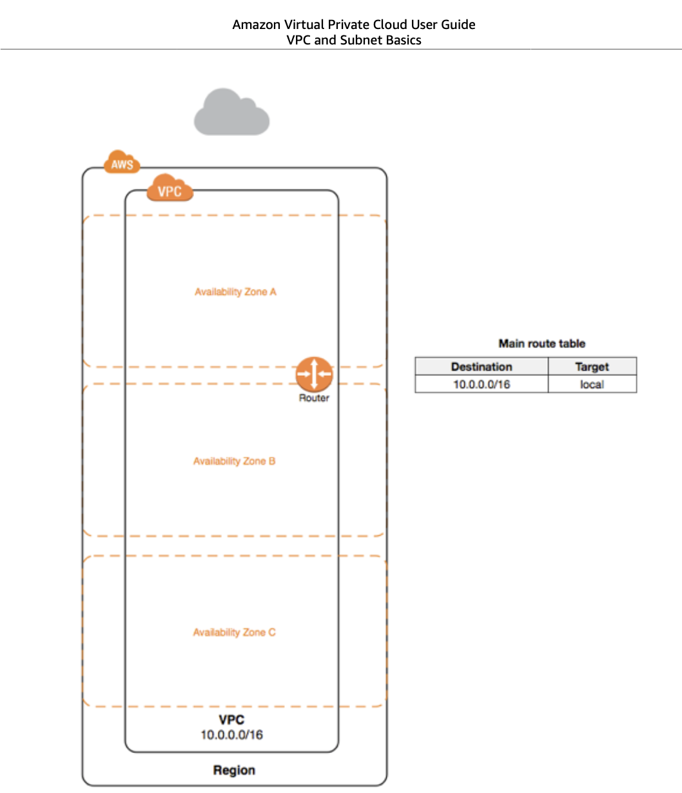
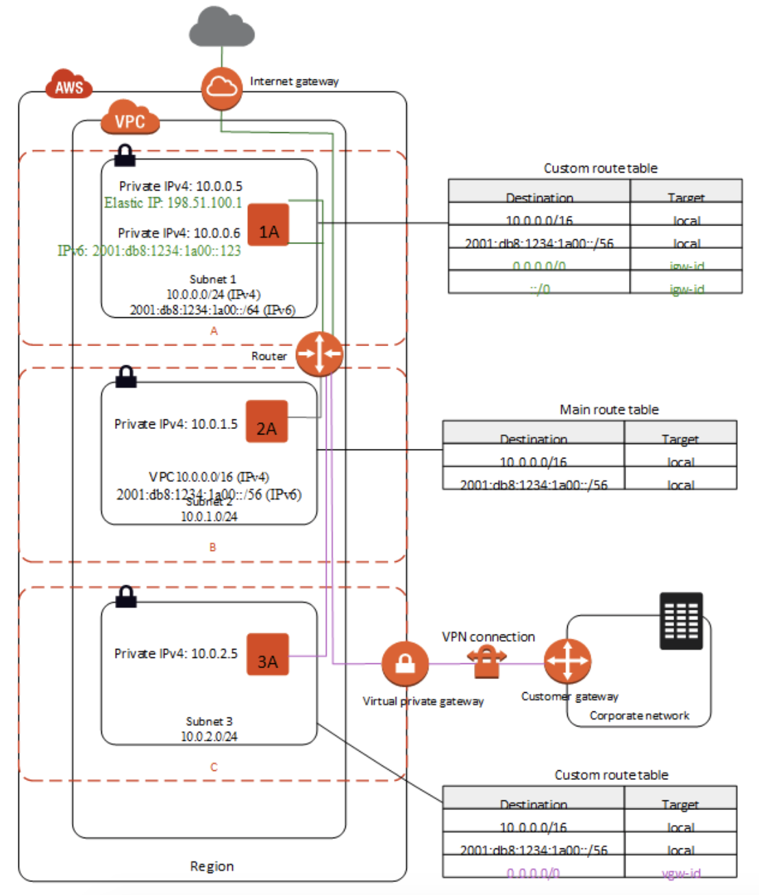

# AWS VPC

Amazon VPC enables you to launch AWS resources into a virtual network that you've defined. This virtual network
closely resembles a traditional network that you'd operate in your own data center, with the benefits of using
the scalable infrastructure of AWS.

## Concepts
Amazon VPC is the networking layer of EC2. 

Key concepts:
* A *virtual private cloud* (VPC) is a virtual network dedicated to your AWS account.
  * It is logically isolated from other virtual networks in the AWS Cloud. You can launch
    your AWS resources, such as Amazon EC2 instances, into your VPC. You can specify an
    IP address range for the VPC, add subnets, associate security groups, and configure
    route tables.
* A *subnet* is a range of IP addresses in your VPC.
  * You can launch AWS resources into a specified subnet. Use a public subnet for resources
    that must be connected to the internet, and a private subnet for resources that won't be
    connected to the internet.
* A *route table* contains a set of rules, called routes, that are used to determine where network
  traffic is directed.
* An *internet gateway* is a horizontally scaled, redundant, and highly available VPC component that
  allows communication between instances in your VPC and the internet. It therefore imposes no availability
  risks or bandwidth constraints on your network traffics.
* A *VPC endpoint* enables you to privately connect your VPC to supported AWS services and VPC
  endpoint services powered by PrivateLink without requiring an internet gateway., NAT device,
  VPN connection, or AWS Direct Connect connection. Instances in your VPC do not require public IP addresses
  to communicate with resources in the service. Traffic between your VPC and the other service does not
  leave the Amazon network.

## Accessing the Internet
You control how the instances that you launch into a VPC access resources outside the VPC. Your default
VPC includes an internet gateway, and each default subnet is a public subnet. Each instance that you
launch into a default subnet has a private IPv4 address and a public IPv4 address. These instances can
communicate with the internet through the internet gateway. An internet gateway enables your instances
to connect to the internet through the Amazon EC2 network edge.

## VPC and Subnet Basics
When you create a vpc, you must specify a range of IPv4 addresses for the VPC in the form of a Classless
Inter-Domain Routing (CIDR) block; for example `10.0.0.0/16`. This is the primary CIDR block for your vpc.

The following diagram shows a new VPC with an IPv4 CIDR block, and the main route table.

A vpc spans all of the Availability Zones in the Region. After creating a VPC, you can add 1 or more subnets
in each Availablity Zone. You can optionally add subnets in a Local Zone, which is an AWS infrastructure
deployment that places compute, storage, database, and other select services closer to your end users. A
Local Zone enables your end users to run applications that require single-digit millisecond latencies. When
you create a subnet, you specify the CIDR block for the subnet, which is a subset of the vpc CIDR block. Each
subnet must reside entirely within 1 Availability Zone and cannot span zones. Availability Zones are distinct
locations that are engineered to be isolated from failures in other Availability Zones. By launching instances
in seperate Availability Zones, you can protect your applications from the failure of a single location. We
assign a unique id to each subnet.

You can optionally assign an IPv6 CIDR block to your VPC, and assign IPv6 CIDR blocks to your subnets.

The following diagram shows a vpc that has been configured with subnets in multiple Availability Zones.
1A, 1B, 2A, and 3A are instances in your vpc. An IPv6 CIDR block is associated with the vpc, and an
IPv6 CIDR block is associated with subnet 1. An internet gateway enables communication over the
internet, and a virtual private network (VPN) connection enables communication with your corporate
network.

If a subnet's traffic is routed to an internet gateway, the subnet is known as a *public subnet*.
In this diagram, subnet 1 is a public subnet. If you want your instance in a public subnet to
communicate with the internet over IPv4, it must have a public IPv4 address or elastic IP address (IPv4).
If you want your instance in the public subnet to communicate with the internet over IPv6, it must have
an IPv6 address.

If a subnet doesn't have a route to the internet gateway, the subnet is known as a *private subnet*.
In this diagram, subnet 2 is a private subnet.

If a subnet doesn't have a route to the internet gateway, but has its traffic routed to a virtual
private gateway for a Site-to-Site VPN connection, the subnet is known as a *VPN-only subnet*. In
this diagram, subnet 3 is a VPN-only subnet. Currently, we do not support IPv6 traffic over a
Site-to-Site VPN connection. Regardless of the type of subnet, the internal IPv4 address range of
the subnet is always private--we do not announce the address block to the internet.

## Subnet Routing
Each subnet must be associated with a route table, which specifies the allowed routes for outbound
traffic leaving the subnet. Every subnet that you create is automatically associated with the main
route table for the vpc. You can change the association, and you can change the contents of the
main route table.

(IPv4) The Elastic IPv4 address or public IPv4 address that's associated with your instance is
accessed through the internet gateway of your vpc. Traffic that goes through an AWS Site-to-Site
VPN connection between your instance and another network traverses a virtual private gateway,
not the internet gateway, and therefore does not access the Elastic IPv4 address or public
IPv4 address.

You can allow an instance in your vpc to initiate outbound connections to the internet over IPv4
but prevent unsolicited inbound connections from the internet using a network address translation (NAT)
gateway or instance. Because you can allocate a limited number of Elastic IP addresses, we recommend
that you use a NAT device if you have more instances that require a static public address. To initiate
outbound-only communication to the internet over IPv6, you can use an egress-only internet gateway.